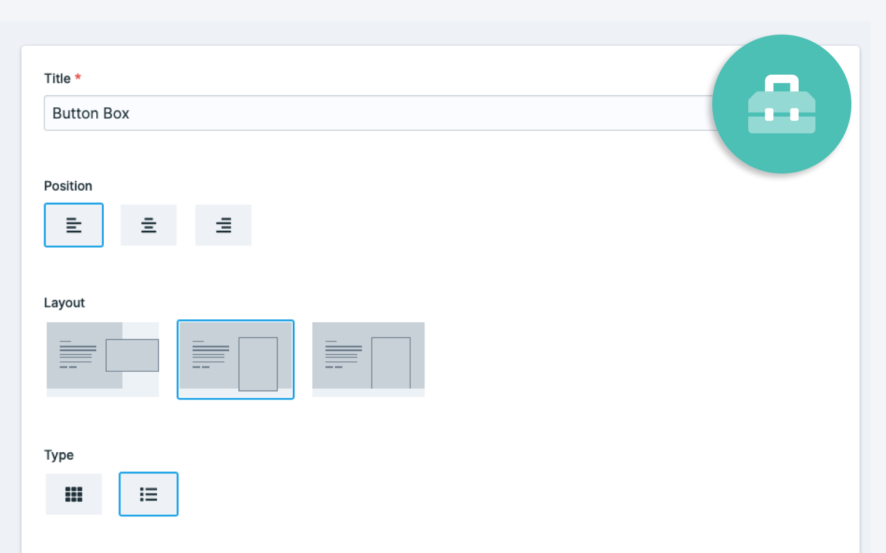

[](https://github.com/riasvdv/statamic-button-box/releases)

# Button Box

> Button Box for Statamic 3.

Create beautiful choices for your clients.



## License

Button Box requires a license to be used while on a production site.  
You can purchase one at https://statamic.com/marketplace/addons/button-box.

You may use Button Box without a license while Statamic is in [Trial mode](https://docs.statamic.com/knowledge-base/trial-mode).

## Installation

Require it using Composer.

```
composer require rias/statamic-button-box
```

Publish the assets and configuration:

```
php artisan vendor:publish --provider="Rias\ButtonBox\ServiceProvider"
```

## Using Button Box

Add the fieldtype to your fieldset. 

Each option contains the following fields:

- label - This is show when neither an icon or an image is present
- value - The value that you'll use in your templates
- image - An image
- icon - A [FontAwesome Free](https://fontawesome.com/icons?d=gallery&m=free) icon

```yaml
sections:
  main:
    display: Main
    fields:
      -
        handle: choice
        field:
          type: button_box
          display: Choice
          options:
            -
              label: Left
              value: left
              image: left.svg
              icon: null
            -
              label: Center
              value: center
              image: center.svg
              icon: null
            -
              label: Right
              value: right
              image: right.svg
              icon: null
```

## Using Button Box

You can access both the label and color in your template.

```twig
{{ choice }} # will contain either "left", "center" or "right" from the example above
```

## Using a different Asset container

Button Box comes with a configuration file that you can change after publishing, it will live at `config/statamic/button-box.php`, here you can define the handle of the Asset Container that has to be used for the images.

```php
return [
    /**
     * If you want Button Box to use a different container
     * you can define the container handle to be used.
     */
    'container' => null,
];

```

Brought to you by [Rias](https://rias.be)
